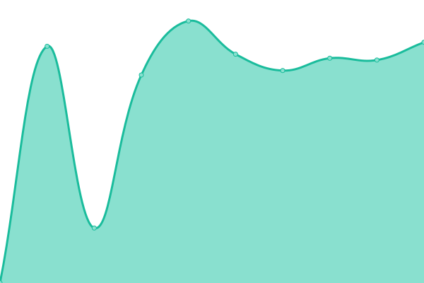

# [📈 Live Status](https://status.hmuy.me): <!--live status--> **🟧 Partial outage**

This repository contains the open-source uptime monitor and status page for [khanhhmuy](https://status.hmuy.me), powered by [Upptime](https://github.com/upptime/upptime).

With [Upptime](https://upptime.js.org), you can get your own unlimited and free uptime monitor and status page, powered entirely by a GitHub repository. We use [Issues](https://github.com/khanhhmuy/webstatus/issues) as incident reports, [Actions](https://github.com/khanhhmuy/webstatus/actions) as uptime monitors, and [Pages](https://status.hmuy.me) for the status page.

<!--start: status pages-->
<!-- This summary is generated by Upptime (https://github.com/upptime/upptime) -->
<!-- Do not edit this manually, your changes will be overwritten -->
<!-- prettier-ignore -->
| URL | Status | History | Response Time | Uptime |
| --- | ------ | ------- | ------------- | ------ |
|  [picoshare](https://share.hmuy.live) | 🟥 Down | [picoshare.yml](https://github.com/khanhmuy/webstatus/commits/HEAD/history/picoshare.yml) | 

 7238ms
     
 | 

<a href="https://status.hmuy.live/history/picoshare">88.56%</a>
    

|  [microbin](https://bin.hmuy.live) | 🟥 Down | [microbin.yml](https://github.com/khanhmuy/webstatus/commits/HEAD/history/microbin.yml) | 

 7273ms
     
 | 

<a href="https://status.hmuy.live/history/microbin">88.59%</a>
    

|  [jellyfin](https://jellyfin.hmuy.live) | 🟥 Down | [jellyfin.yml](https://github.com/khanhmuy/webstatus/commits/HEAD/history/jellyfin.yml) | 

 1106ms
     
 | 

<a href="https://status.hmuy.live/history/jellyfin">88.60%</a>
    

|  [screenshots](https://ss.hmuy.live) | 🟩 Up | [screenshots.yml](https://github.com/khanhmuy/webstatus/commits/HEAD/history/screenshots.yml) | 

 6476ms
     
 | 

<a href="https://status.hmuy.live/history/screenshots">88.63%</a>
    

<!--end: status pages-->

[**Visit our status website →**](https://status.hmuy.me)

## 📄 License

- Powered by: [Upptime](https://github.com/upptime/upptime)
- Code: [MIT](./LICENSE) © [Anand Chowdhary](https://anandchowdhary.com), supported by [Pabio](https://pabio.com)
- Data in the `./history` directory: [Open Database License](https://opendatacommons.org/licenses/odbl/1-0/)
